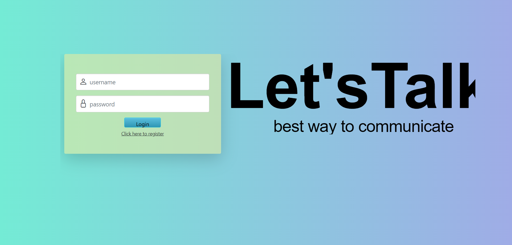
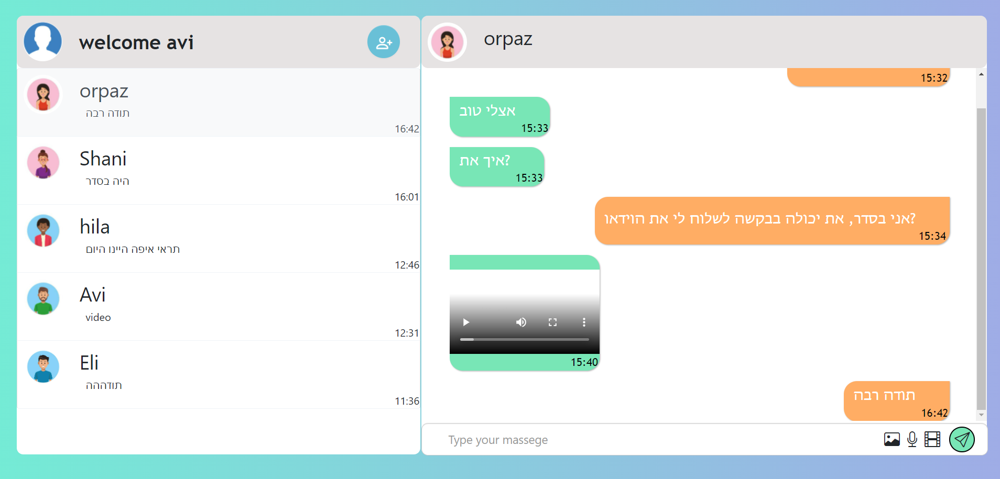

# Ass1 web-client 

## about this project
In the project we created Chat site with three pages:

### Login page
On this page, existing users can log in to the site using their username and password stored in the system.
To log in successfully the user must enter a valid password and username.

### Registration page
On this page you can register for the site. The user must enter a valid username, nickname and password. 
The user can select a profile picture. After successful registration the user is redirected to the chat page.

### Chat page
On this page on the left there is a list of user chats. When you click on a specific contact, the user's chat with that contact appears on the right.
You can send new messages (text, picture, video and voice messages).
In addition, a new correspondence contact can be added.

## Getting Started
Possible username and password to log in to the site: 
* Username: hemihemi 
 Password: hemi12345 
* Username: orpazsond 
 Password: orpaz12345 
## Built With

* react
* bootsrap

## packeges we used

* react-router-dom
* react-bootsrap
