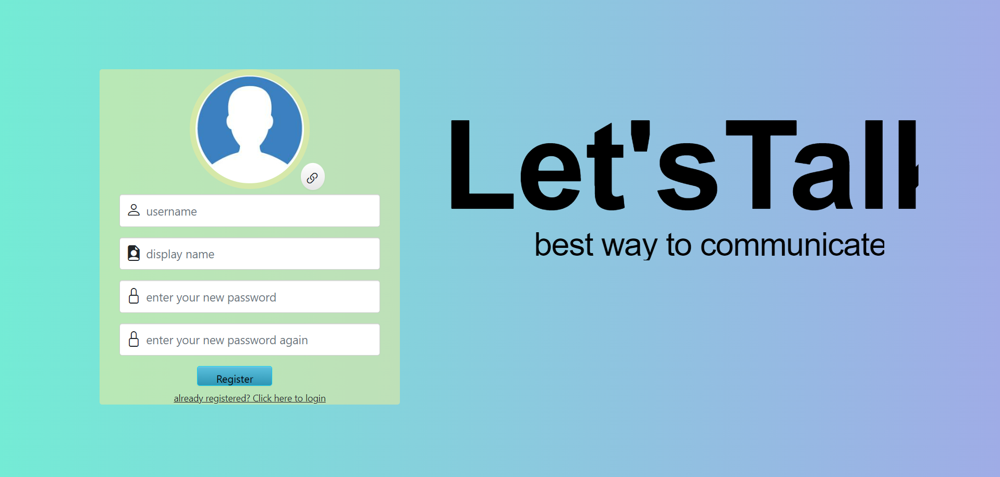

# Ass2 server-client 

## about this project
In the project we created Chat site with three pages:

### Login page
On this page, existing users can log in to the site using their username and password stored in the server. 
To log in successfully the user must enter a valid password and username. 
 

### Registration page
On this page you can register for the site. The user must enter a valid username, nickname and password.  
After successful registration the user is redirected to the chat page. 
 

### Chat page
On this page on the left there is a list of user chats.  
You can send new messages (text) to other users and communicate. 
You can add a new user by adding his username, and his server, a validation check is performed and if the details are correct the new user is added successfully. 
In this way you can communicate with users on another server. 
 

## Getting Started
type npm start in commend line.  
register to the site and get started! 

## Built With

* react
* bootsrap

## packeges we used

* react-router-dom
* react-bootsrap
* @microsoft/signalr
